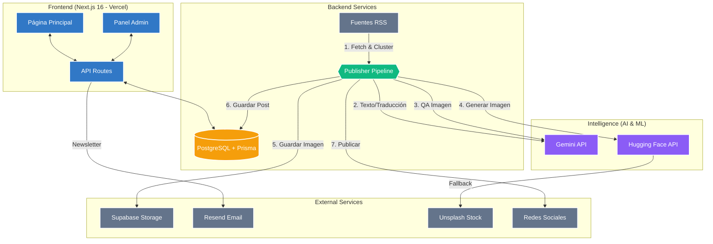

# Arquitectura de EmeDotEme

## Visión general

EmeDotEme es un sistema automatizado para la generación y publicación de artículos de noticias sobre criptomonedas, blockchain, tecnología e inteligencia artificial.

## Diagrama de arquitectura

## Componentes principales

### Frontend (Next.js)
- **Páginas**: Inicio, artículos, categorías.
- **Panel de administración**: Gestión de contenido.
- **Rutas API**: Endpoints para generación y suscripción.
- **Feeds**: RSS y Atom.

### Base de datos
- PostgreSQL con Prisma ORM.
- Tablas: Articles, Categories, Tags, Subscribers, Settings.

### Pipeline de contenido
- **Servicio de fuentes de noticias**: Fetch y normalización de fuentes RSS (CoinDesk, Decrypt, etc.).
- **Servicio de IA**: Generación bilingüe con Gemini (gemini-2.5-flash), con rotación de hasta 3 claves API.
- **Servicio de imágenes**: Pipeline jerárquico (RSS -> Hugging Face -> Unsplash de stock), con QA vía Gemini Vision.

## Referencias

- [[02 - Stack Tecnológico]]
- [[04 - Flujos de Trabajo]]