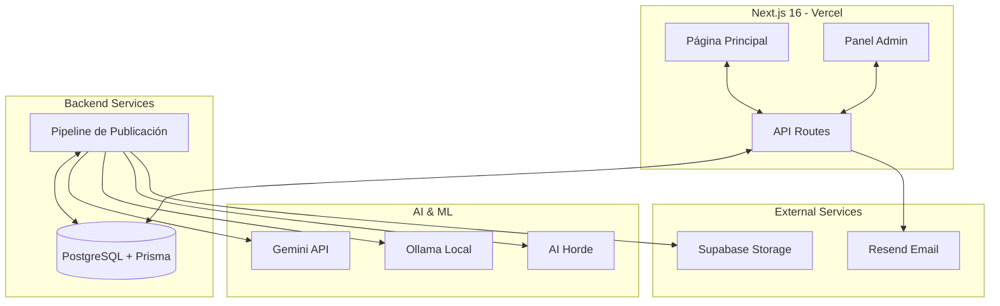

# Arquitectura de EmeDotEme

## Visión general

EmeDotEme es un sistema automatizado para la generación y publicación de artículos de noticias sobre criptomonedas, blockchain, tecnología e inteligencia artificial.

## Diagrama de arquitectura

## Componentes principales

### Frontend (Next.js)
- **Páginas**: Inicio, artículos, categorías.
- **Panel de administración**: Gestión de contenido.
- **Rutas API**: Endpoints para generación y suscripción.
- **Feeds**: RSS y Atom.

### Base de datos
- PostgreSQL con Prisma ORM.
- Tablas: Articles, Categories, Subscribers, Analytics.

### Pipeline de contenido
- **Servicio de fuentes de noticias**: Fetch y normalización de fuentes RSS (CoinDesk, Decrypt, etc.).
- **Servicio de IA**: Generación bilingüe con Gemini y fallback a Ollama (qwen3.5:9b). Soporta modelos de razonamiento.
- **Servicio de imágenes**: Pipeline jerárquico (RSS -> Flux.1 Local -> AI Horde) con gestión dinámica de VRAM para descargar modelos de Ollama antes de activar la GPU para Flux.

## Referencias

- [[02 - Stack Tecnológico]]
- [[04 - Flujos de Trabajo]]