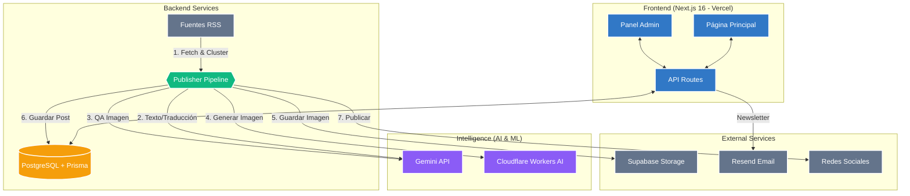

# Arquitectura de EmeDotEme

## Visión general

EmeDotEme es un sistema automatizado para la generación y publicación de artículos de noticias sobre criptomonedas, blockchain, tecnología e inteligencia artificial.

## Diagrama de arquitectura

```mermaid
graph TB
    %% Definición de estilos
    classDef frontend fill:#3178c6,stroke:#fff,stroke-width:2px,color:#fff;
    classDef backend fill:#10b981,stroke:#fff,stroke-width:2px,color:#fff;
    classDef ai fill:#8b5cf6,stroke:#fff,stroke-width:2px,color:#fff;
    classDef db fill:#f59e0b,stroke:#fff,stroke-width:2px,color:#fff;
    classDef external fill:#64748b,stroke:#fff,stroke-width:2px,color:#fff;

    subgraph "Frontend (Next.js 16 - Vercel)"
        UI[Página Principal]:::frontend
        Admin[Panel Admin]:::frontend
        API[API Routes]:::frontend
    end

    subgraph "Backend Services"
        DB[(PostgreSQL + Prisma)]:::db
        Pipeline{{"Publisher Pipeline"}}:::backend
        RSS[Fuentes RSS]:::external
    end

    subgraph "Intelligence (AI & ML)"
        Gemini[Gemini API]:::ai
        CF[Cloudflare Workers AI]:::ai
    end

    subgraph "External Services"
        Supa[Supabase Storage]:::external
        Resend[Resend Email]:::external
        Social[Redes Sociales]:::external
    end

    %% Data Flow
    UI <--> API
    Admin <--> API
    API <--> DB
    
    %% Pipeline Flow
    RSS -- "1. Fetch & Cluster" --> Pipeline
    Pipeline -- "2. Texto/Traducción" --> Gemini
    Pipeline -- "3. QA Imagen" --> Gemini
    Pipeline -- "4. Generar Imagen" --> CF
    Pipeline -- "5. Guardar Imagen" --> Supa
    Pipeline -- "6. Guardar Post" --> DB
    Pipeline -- "7. Publicar" --> Social
    API -- "Newsletter" --> Resend
```

## Componentes principales

### Frontend (Next.js)
- **Páginas**: Inicio, artículos, categorías.
- **Panel de administración**: Gestión de contenido.
- **Rutas API**: Endpoints para generación y suscripción.
- **Feeds**: RSS y Atom.

### Base de datos
- PostgreSQL con Prisma ORM.
- Tablas: Articles, Categories, Tags, Subscribers, Settings.

### Pipeline de contenido
- **Servicio de fuentes de noticias**: Fetch y normalización de fuentes RSS (CoinDesk, Decrypt, etc.).
- **Servicio de IA**: Generación bilingüe con Gemini (gemini-2.5-flash), con rotación de hasta 3 claves API.
- **Servicio de imágenes**: Cascada en tres pasos — **Pixabay** (fotografía con licencia comercial) → **Cloudflare Workers AI / FLUX.1-schnell** (generación con IA) → **imagen de reserva del proyecto**. Cada candidata pasa por un control de calidad con Gemini Vision. El pipeline **no lanza nunca**: si todo falla, se publica con la reserva, porque perder el artículo es peor que publicarlo con una foto genérica. **No se usan imágenes de prensa**: el art. 129 bis.2 del TRLPI exige autorización para poner a disposición imágenes de publicaciones de prensa, así que a la fuente original se la **enlaza**, no se la copia.

## Referencias

- [[02 - Stack Tecnológico]]
- [[04 - Flujos de Trabajo]]