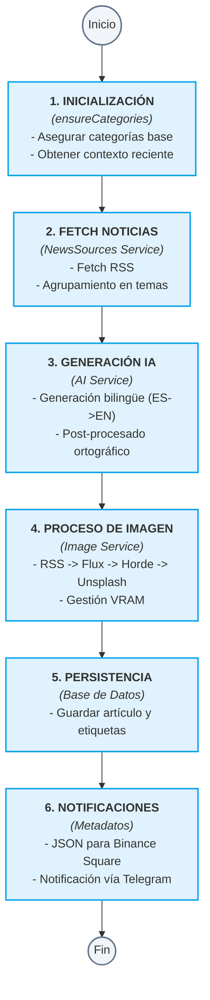
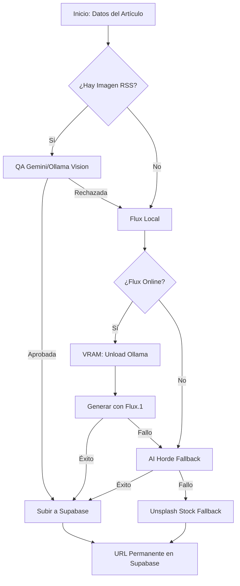

# Flujos de Trabajo de EmeDotEme

## Índice

- Pipeline de publicación (Publisher Service)
- Flujo de imágenes
- Flujo de IA
- Gestión de Memoria (VRAM)
- Cron jobs

---

## Pipeline de publicación

### Descripción general

El pipeline de publicación es el flujo principal que genera y publica automáticamente un artículo cada día. Ha sido refactorizado en un **Publisher Service** para mejorar la modularidad y resiliencia.

### Diagrama del Pipeline



### Código de ejecución

```bash
# El script principal ahora es un simple wrapper del PublisherService
npx tsx scripts/publish.ts
```

### Variables de entorno CRÍTICAS

> [!WARNING]
> A diferencia de versiones anteriores, **no existen modelos por defecto** para Ollama. Si no están en el `.env`, el sistema fallará explícitamente para garantizar el control del desarrollador.

```env
OLLAMA_MODEL="gemma4:26b"         # Para generación de texto y corrección
OLLAMA_VISION_MODEL="gemma4:e4b"  # Para análisis visual (Vision)
```

---

## Flujo de imágenes

### Pipeline de imagen detallado



### Gestión de Supabase (StorageService)
Toda imagen aceptada o generada se sube automáticamente a Supabase Storage para evitar enlaces rotos de fuentes externas.

---

## Flujo de IA

El flujo de IA ahora utiliza **AI_PROMPTS** centralizados en `config/prompts.ts`.

### Postprocesado

El postprocesado ortográfico es obligatorio y se realiza mediante Ollama en local tras la generación del contenido en español, asegurando la calidad de nombres propios y siglas antes de proceder a la traducción al inglés.

---

## Gestión de Memoria (VRAM)

Dada la limitación de VRAM (ej. 8GB), el `VRAMManager` centraliza el control:

1.  **Keep Alive 0**: Todas las llamadas a Ollama liberan memoria inmediatamente.
2.  **Unload Explícito**: Antes de usar Flux, se fuerza la descarga de Ollama.
3.  **Pausas de Estabilización**:
    *   **8s**: Limpieza física de buffers del driver NVIDIA.
    *   **5s**: Estabilización previa a la carga de Flux.

---

## Cron jobs

| Job                 | Frecuencia         | Script                      |
|---------------------|-------------------|-----------------------------|
| Publicación diaria  | 1x día (8:00 UTC) | `scripts/publish.ts`        |
| Newsletter semanal  | 1x semana         | `scripts/send_newsletter.ts`|
