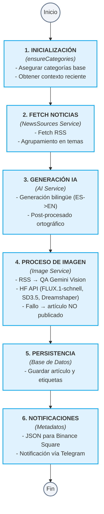
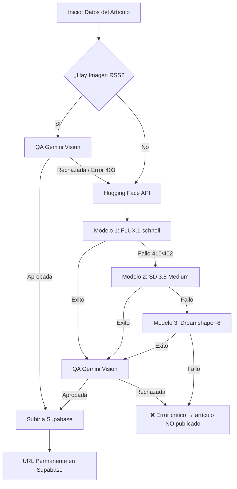

# Flujos de Trabajo de EmeDotEme

## Índice

- Pipeline de publicación (Publisher Service)
- Flujo de imágenes
- Flujo de IA
- Gestión de Memoria (VRAM)
- Cron jobs

---

## Pipeline de publicación

### Descripción general

El pipeline de publicación es el flujo principal que genera y publica automáticamente un artículo cada día. Ha sido refactorizado en un **Publisher Service** para mejorar la modularidad y resiliencia.

### Diagrama del Pipeline



### Código de ejecución

```bash
# El script principal ahora es un simple wrapper del PublisherService
npx tsx scripts/publish.ts
```

### Variables de entorno CRÍTICAS

> [!NOTE]
> La generación de imágenes y texto funciona exclusivamente a través de APIs en la nube (Gemini, Hugging Face). Ollama y Flux local están completamente desactivados.

```env
# No requeridas en cloud — desactivadas por defecto
# OLLAMA_MODEL="gemma4:26b"
# OLLAMA_VISION_MODEL="gemma4:e4b"
```

---

## Flujo de imágenes

### Pipeline de imagen detallado



### Gestión de Supabase (StorageService)
Toda imagen aceptada o generada se sube automáticamente a Supabase Storage para evitar enlaces rotos de fuentes externas.

---

## Flujo de IA

El flujo de IA ahora utiliza **AI_PROMPTS** centralizados en `config/prompts.ts`.

### Generación de imagen (`imagePrompt`)

Gemini genera una descripción visual concreta en inglés que se usa para generar la imagen con FLUX.1-schnell. Las reglas son:
- ✅ Escenas **fotorrealistas** estilo Reuters/Bloomberg: salas de trading, reuniones, edificios, pantallas
- ❌ Prohibido: cyberpunk, neon, digital art, glowing nodes, 3D renders, sci-fi

El servicio HF antepone automáticamente un prefijo de calidad al prompt antes de enviárselo al modelo:
```
photorealistic, high resolution, professional press photograph, editorial photography,
sharp focus, natural lighting, 4k quality, realistic textures, no watermarks, no text overlays,
[descripción del artículo],
hyperdetailed, award-winning photograph, documentary style
```

### Publicación en redes sociales y hashtags dinámicos

Los scripts de Python (`publish_telegram.py`, `publish_direct.py`, `publish_bluesky.py`) leen el archivo `tmp/latest_article.json` generado por el pipeline. Las etiquetas (`tags`) del artículo se convierten automáticamente en hashtags mediante `format_hashtags()` en `social_publish_utils.py`:
- `#EmeDotEme` siempre es el **primer hashtag**
- Los tags del artículo se convierten a PascalCase sin caracteres especiales (ej. `"Banca Sella"` → `#BancaSella`)
- El mensaje de Telegram **no incluye precios de criptomonedas** ni índice Fear & Greed

### Postprocesado

El postprocesado ortográfico en local mediante Ollama ha sido **desactivado** para habilitar la ejecución serverless en la nube, optimizando el tiempo y dependiendo exclusivamente del modelo `gemini-2.5-flash` para la generación y coherencia.

---

## Gestión de Memoria (VRAM) - (Desactivado en Cloud)

Al correr de manera serverless en GitHub Actions y consumir APIs en la nube (Gemini, Hugging Face), no hay un consumo de recursos de tarjeta gráfica (GPU/VRAM) local ni contenedores Docker locales que gestionar. La clase `VRAMManager` y sus métodos siguen existiendo por compatibilidad pero no realizan operaciones de espera o descarga.

---

## Automatización y Flujo Temporal

La ejecución automática se orquesta nativamente mediante **GitHub Actions** en contenedores efímeros bajo demanda:

| Proceso | Frecuencia | Orquestador | Comando Ejecutado |
|---------|------------|-------------|-------------------|
| **Publicación automática** | Cada 4 horas (`0 */4 * * *`) | GitHub Actions | `./publicar.sh` |
| **Envío de Newsletter** | Semanal | GitHub Actions (opcional) | `./enviar_newsletter.sh` |
| **Ejecución de Prueba** | Manual | GitHub Actions (`workflow_dispatch`) | `./publicarprueba.sh` |
