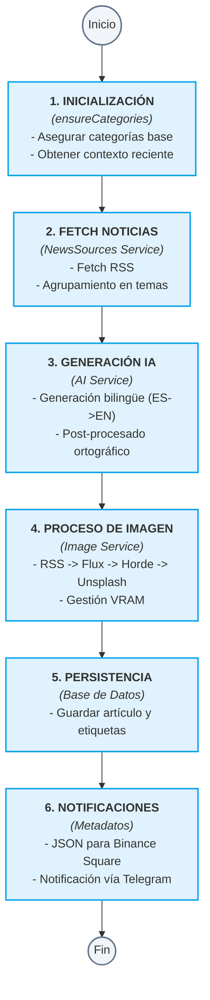
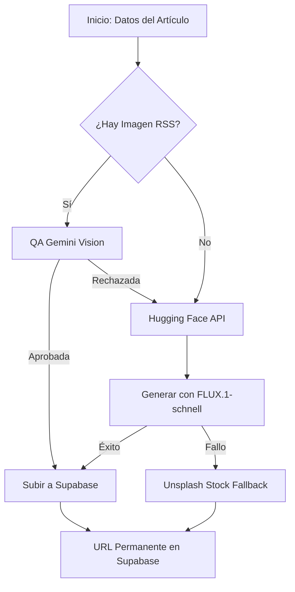

# Flujos de Trabajo de EmeDotEme

## Índice

- Pipeline de publicación (Publisher Service)
- Flujo de imágenes
- Flujo de IA
- Gestión de Memoria (VRAM)
- Cron jobs

---

## Pipeline de publicación

### Descripción general

El pipeline de publicación es el flujo principal que genera y publica automáticamente un artículo cada día. Ha sido refactorizado en un **Publisher Service** para mejorar la modularidad y resiliencia.

### Diagrama del Pipeline



### Código de ejecución

```bash
# El script principal ahora es un simple wrapper del PublisherService
npx tsx scripts/publish.ts
```

### Variables de entorno CRÍTICAS

> [!WARNING]
> A diferencia de versiones anteriores, **no existen modelos por defecto** para Ollama. Si no están en el `.env`, el sistema usará exclusivamente Gemini para la generación de texto.

```env
OLLAMA_MODEL="qwen3.5:9b"        # Para generación de texto local (opcional)
OLLAMA_VISION_MODEL=""            # Para análisis visual local (opcional)
```

---

## Flujo de imágenes

### Pipeline de imagen detallado



### Gestión de Supabase (StorageService)
Toda imagen aceptada o generada se sube automáticamente a Supabase Storage para evitar enlaces rotos de fuentes externas.

---

## Flujo de IA

El flujo de IA ahora utiliza **AI_PROMPTS** centralizados en `config/prompts.ts`.

### Postprocesado

El postprocesado ortográfico en local mediante Ollama ha sido **desactivado** para habilitar la ejecución serverless en la nube, optimizando el tiempo y dependiendo exclusivamente del modelo `gemini-2.5-flash` para la generación y coherencia. Ollama sigue disponible como opción para entornos locales con GPU.

---

## Gestión de Memoria (VRAM)

El `VRAMManager` gestiona la memoria de GPU para entornos con hardware limitado, alternando entre Ollama y Flux.1 cuando ambos están configurados localmente. En entornos cloud/serverless, este módulo no realiza operaciones activas pero permanece disponible.

---

## Automatización y Flujo Temporal

La ejecución automática se orquesta mediante **GitHub Actions** en contenedores efímeros bajo demanda:

| Proceso | Frecuencia | Orquestador | Comando Ejecutado |
|---------|------------|-------------|-------------------|
| **Publicación automática** | Cada 4 horas (`0 */4 * * *`) | GitHub Actions | `./publicar.sh` |
| **Envío de Newsletter** | Semanal | GitHub Actions (workflow_dispatch) | `./enviar_newsletter.sh` |
| **Ejecución de Prueba** | Manual | GitHub Actions (`workflow_dispatch`) | `./publicarprueba.sh` |
