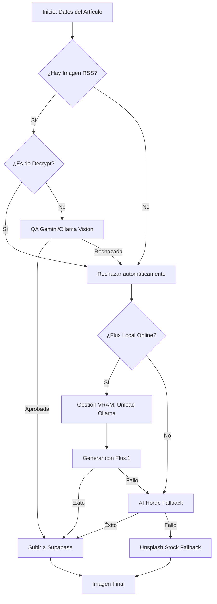

# Flujos de Trabajo de EmeDotEme

## Índice

- Pipeline de publicación
- Flujo de imágenes
- Flujo de IA
- Cron jobs

---

## Pipeline de publicación

### Descripción general

El pipeline de publicación es el flujo principal que genera y publica automáticamente un artículo cada día.

### Diagrama

```
+-------------------------------------------------------------+
|                 PIPELINE DE PUBLICACIÓN                    |
+-------------------------------------------------------------+
                              |
                              v
+-------------------------------------------------------------+
| 1. INICIALIZACIÓN                                            |
|    - Cargar categorías desde la BD                           |
|    - Obtener títulos recientes                               |
|    - Obtener URLs recientes                                  |
+-------------------------------+-----------------------------+
                              |
                              v
+-------------------------------------------------------------+
| 2. FETCH NOTICIAS (NewsSources Service)                     |
|    +---------------------------------------------------+    |
|    | - Fetch RSS de fuentes fiables                     |    |
|    | - Parsear y filtrar noticias (últimas 48h)         |    |
|    | - Deduplicar por similitud de títulos              |    |
|    | - Filtrar artículos ya cubiertos                   |    |
|    | - Clustering por tema                              |    |
|    +---------------------------------------------------+    |
|    Resultado: newsItems[]                                   |
+-------------------------------+-----------------------------+
                              |
                              v
+-------------------------------------------------------------+
| 3. GENERACIÓN IA (AI Service)                               |
|    +---------------------------------------------------+    |
|    | SYSTEM PROMPT: "Eres periodista profesional..."    |    |
|    | USER PROMPT: Noticias + instrucciones               |    |
|    +---------------------------------------------------+    |
|                           |                               |
|              +------------+-----------+                   |
|              v                        v                  |
|         GEMINI API            OLLAMA LOCAL                |
|              |                        |                  |
|              +-> OK -> JSON válido  +-> JSON válido      |
|              |                        |                  |
|              +-- FAIL --+          +-- FAIL --+          |
|              v                        v                  |
|         Try Ollama         Artículo de ejemplo            |
|              |                        |                  |
|              +-- FAIL --+          +-- (ERROR)           |
|                         v                        v       |
|                     Artículo de ejemplo                  |
|                     (notifica Telegram)                  |
|                                                          |
|    Resultado: {title, summary, content, tags, ...}        |
+-------------------------------+-----------------------------+
                              |
                              v
+-------------------------------------------------------------+
| 4. TRADUCCIÓN Y POSTPROCESADO                              |
|    +---------------------------------------------------+    |
|    | generateEnglishContent()                           |    |
|    |   - Añade campos *_en (titleEn, summaryEn, ...)    |    |
|    +---------------------------------------------------+    |
|                           |                               |
|                           v                               |
|    +---------------------------------------------------+    |
|    | postprocessWithOllama()                            |    |
|    |   - Corrige mayúsculas                             |    |
|    |   - Nombres propios, siglas                        |    |
|    |   - Fallback: Regex recovery si falla JSON         |    |
|    +---------------------------------------------------+    |
+-------------------------------+-----------------------------+
                              |
                              v
+-------------------------------------------------------------+
| 5. PROCESO DE IMAGEN (Image Service)                        |
|    +----------------------------------------+               |
|    | generateArticleImageAndAnalyzeQA()      |               |
|    +----------------------------------------+               |
|                           |                                 |
|              +------------+-----------+                     |
|              v            v           v                     |
|       RSS SOURCE     FLUX LOCAL   AI HORDE                  |
|     (No Decrypt)     (PRIORITY)   (FALLBACK)                |
|              |            |           |                     |
|              +-- GESTIÓN VRAM: UNLOAD OLLAMA (13s) --+      |
|                                            |
|    Resultado: {imageUrl, caption}                           |
+-------------------------------+------------+
                              |
                              v
+-------------------------------------------------------------+
| 6. GUARDAR EN BASE DE DATOS                                 |
|    +-------------------------------------------+            |
|    | prisma.article.create({                    |            |
|    |   title, titleEn, slug, summary, ...       |            |
|    |   published: true,                         |            |
|    |   publishedAt: new Date()                  |            |
|    | })                                         |            |
|    +-------------------------------------------+            |
|    *Nota: El Ranking Engine priorizará este         |
|    artículo según su fecha y peso.                  |
+-------------------------------+------------+----------------+
                              |
                              v
+-------------------------------------------------------------+
| 7. PUBLICAR EN REDES SOCIALES (opcional)                    |
|    - Guardar latest_article.json para Binance Square         |
|    - Notificar errores por Telegram                         |
+-------------------------------------------------------------+
```

### Código de ejecución

```bash
# Manual
npx tsx scripts/publish.ts

# O automáticamente vía Cron Job (configurado en cron-job.org)
```

### Variables de entorno requeridas

```env
# Base de datos
DATABASE_URL=

# Gemini
GEMINI_API_KEY=

# Ollama (local)
OLLAMA_MODEL=llama3.1:8b

# Telegram (para notificaciones)
TELEGRAM_TOKEN=
TELEGRAM_CHAT_ID=

# Supabase
SUPABASE_URL=
SUPABASE_SERVICE_ROLE_KEY=
```

### Referencias

- [[06 - Scripts]]
- [[05 - Configuración]]

---

## Flujo de imágenes

### Pipeline de imagen detallado



### Handoff de Memoria (VRAM)

Dada la limitación de 8GB de VRAM en entornos locales comunes, el sistema implementa un flujo de "entrega" de memoria entre Ollama (texto) y Flux (imagen):

1. **Keep Alive**: Todas las peticiones a Ollama se realizan con `keep_alive: 0`, solicitando a Ollama que libere el modelo inmediatamente tras la respuesta.
2. **Health Check**: El pipeline verifica si el servidor de Flux (`flux-api-server`) está listo para recibir peticiones.
3. **Descarga Explícita**: Se invoca `unloadOllamaModels()` para asegurar que cualquier modelo residual sea purgado.
4. **Pausa de Purga (8s)**: Espera obligatoria de 8 segundos para que el driver de NVIDIA libere físicamente los recursos.
5. **Estabilización (5s)**: Pausa de 5 segundos adicionales antes de que Flux comience a cargar sus tensores en la GPU.
6. **Optimización Flux**: El servidor Flux utiliza `sequential_cpu_offload` y `VAE tiling` para mantener el uso de memoria bajo el límite de 8GB durante toda la generación.

### Código

```typescript
const result = await generateArticleImageAndAnalyzeQA(
  { title, slug, topic, originalPrompt, summary },
  rssImageUrl // de la noticia
)
```

### Referencias

- [[03 - Módulos]]

---

## Flujo de IA

### Generación de texto

```
+-------------------------------------------------------------+
|        FLUJO DE GENERACIÓN DE ARTÍCULO                      |
+-------------------------------------------------------------+
                              |
                              v
+-------------------------------------------------------------+
| INPUT: Contexto                                              |
|    - recentTitles: string[]                                  |
|    - newsItems: NewsItem[]                                   |
+-------------------------------+-----------------------------+
                              |
                              v
+-------------------------------------------------------------+
| SYSTEM PROMPT                                                |
|    "Eres un periodista profesional de noticias               |
|     sobre criptomonedas, blockchain y tecnología             |
|     para el medio digital EmeDotEme..."                      |
+-------------------------------+-----------------------------+
                              |
                              v
+-------------------------------------------------------------+
| USER PROMPT                                                  |
|    - Noticias formateadas                                    |
|    - Instrucciones del artículo                              |
|    - Cláusula de evitación                                   |
+-------------------------------+-----------------------------+
                              |
              +-------------------+-------------------+
              v                                   v
          GEMINI API                            OLLAMA
              |                                   |
              +-> OK -> Parse JSON              +-> OK -> Parse JSON
              |                                   |
              +-- FAIL --+                      +-- FAIL --+
              v                                   v
          Try Ollama                       Ejemplo estático
              |
              +-- FAIL --+
              v
        Ejemplo estático
```

### Postprocesado

```
+-------------------------------------------------------------+
|        POSTPROCESADO ORTOGRÁFICO                            |
+-------------------------------------------------------------+
                              |
                              v
+-------------------------------------------------------------+
| INPUT: Artículo generado                                    |
|    {title, summary, content}                                |
+-------------------------------+-----------------------------+
                              |
                              v
+-------------------------------------------------------------+
| OLLAMA LOCAL: postprocessWithOllama                         |
|    System: "Eres un corrector ortográfico experto..."        |
|    User: JSON.stringify(article)                            |
+-------------------------------+-----------------------------+
                              |
                              v
+-------------------------------------------------------------+
| FALLBACK (Si falla parseo JSON de Ollama)                   |
|    - Usa expresiones regulares para extraer                 |
|      title, summary y content de la respuesta.              |
+-------------------------------+-----------------------------+
                              |
                              v
+-------------------------------------------------------------+
| OUTPUT: Artículo corregido                                  |
|    {title: "...", summary: "...", content: "..."}           |
+-------------------------------------------------------------+
```

### Referencias

- [[03 - Módulos]]

---

## Cron jobs

### Programación

| Job                 | Frecuencia         | Script                      |
|---------------------|-------------------|-----------------------------|
| Publicación diaria  | 1x día (8:00 UTC) | `scripts/publish.ts`        |
| Newsletter semanal  | 1x semana         | `scripts/send_newsletter.ts`|

### Configuración

Los cron jobs se configuran en **cron-job.org** (cuenta gratuita).

### Referencias

- [[05 - Configuración]]