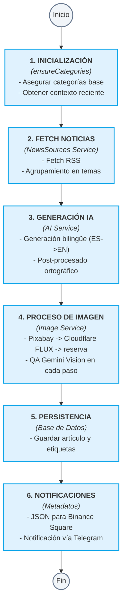
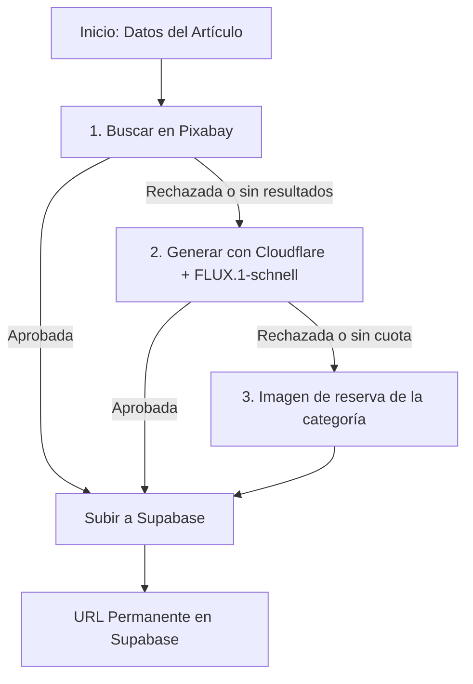

# Flujos de Trabajo de EmeDotEme

## Índice

- Pipeline de publicación (Publisher Service)
- Flujo de imágenes
- Flujo de IA
- Cron jobs

---

## Pipeline de publicación

### Descripción general

El pipeline de publicación es el flujo principal que genera y publica automáticamente un artículo cada día. Ha sido refactorizado en un **Publisher Service** para mejorar la modularidad y resiliencia.

### Diagrama del Pipeline


```mermaid
graph TD
    classDef init fill:#f1f5f9,stroke:#64748b,stroke-width:2px;
    classDef step fill:#e0f2fe,stroke:#0ea5e9,stroke-width:2px;
    classDef alert fill:#fef3c7,stroke:#f59e0b,stroke-width:2px;

    Start((Inicio)):::init --> Step1
    
    Step1["<b>1. INICIALIZACIÓN</b><br/><i>(ensureCategories)</i><br/>- Asegurar categorías base<br/>- Obtener contexto reciente"]:::step --> Step2
    
    Step2["<b>2. FETCH NOTICIAS</b><br/><i>(NewsSources Service)</i><br/>- Fetch RSS<br/>- Agrupamiento en temas"]:::step --> Step3
    
    Step3["<b>3. GENERACIÓN IA</b><br/><i>(AI Service)</i><br/>- Generación bilingüe (ES->EN)<br/>- Post-procesado ortográfico"]:::step --> Step4
    
    Step4["<b>4. PROCESO DE IMAGEN</b><br/><i>(Image Service)</i><br/>- Pixabay -> Cloudflare FLUX -> reserva<br/>- QA Gemini Vision en cada paso"]:::step --> Step5
    
    Step5["<b>5. PERSISTENCIA</b><br/><i>(Base de Datos)</i><br/>- Guardar artículo y etiquetas"]:::step --> Step6
    
    Step6["<b>6. NOTIFICACIONES</b><br/><i>(Metadatos)</i><br/>- JSON para Binance Square<br/>- Notificación vía Telegram"]:::step
    
    Step6 --> End((Fin)):::init
```

### Código de ejecución

```bash
# El script principal ahora es un simple wrapper del PublisherService
npx tsx scripts/publish.ts
```

---

## Flujo de imágenes

### Pipeline de imagen detallado


```mermaid
graph TD
    A[Inicio: Datos del Artículo] --> G[1. Buscar en Pixabay]
    G -- Aprobada --> F[Subir a Supabase]
    G -- Rechazada o sin resultados --> H[2. Generar con Cloudflare + FLUX.1-schnell]
    H -- Aprobada --> F
    H -- Rechazada o sin cuota --> I[3. Imagen de reserva de la categoría]
    I --> F
    F --> L[URL Permanente en Supabase]
```

> [!IMPORTANT]
> **No se usan imágenes de prensa.** Los dos primeros pasos de las versiones anteriores (`og:image` del artículo original e imagen del feed RSS) se han eliminado: el art. 129 bis.2 del TRLPI exige autorización para poner a disposición del público imágenes de publicaciones de prensa. La referencia a la fuente original se hace **enlazándola** (`SourceAttribution`), no copiándola.

### Gestión de Supabase (StorageService)
Toda imagen aceptada o generada se sube automáticamente a Supabase Storage para evitar enlaces rotos. **Solo se re-alojan imágenes propias o con licencia**: `isAllowedToStore()` (`modules/storage/supabase.service.ts`) deja pasar los Data URI de la generación con IA, las fuentes con licencia comercial (Pixabay, Pexels, Unsplash) y el propio almacén; cualquier otro origen se devuelve sin copiar y se avisa en los logs.

### Nunca se descarta el artículo

`generateArticleImageAndAnalyzeQA` (`modules/images/image.service.ts`) recorre la cascada y **no lanza ninguna excepción**: si ninguna candidata supera el control de calidad, devuelve la imagen de reserva de la categoría (`config/constants.ts`) y el artículo se publica igualmente.

Antes esta función terminaba en un `throw`. Un fallo en la generación de imágenes tiraba a la basura el artículo entero: texto ya generado, traducido y pagado. Esa fue la causa real de las pérdidas de artículos durante semanas.

### Control de calidad

Cada candidata pasa por Gemini Vision antes de aceptarse (`isImageValid`). Ese filtro es el suelo de calidad real del proyecto y es **independiente del origen de la imagen**: una foto de archivo mediocre se rechaza exactamente igual que una generación mediocre.

El orden de la cascada va de mejor a peor calidad editorial: una foto real del suceso siempre será preferible a una imagen inventada por IA.

---

## Flujo de IA

El flujo de IA ahora utiliza **AI_PROMPTS** centralizados en `config/prompts.ts`.

### Postprocesado

Toda la generación y postprocesado ortográfico depende exclusivamente del modelo `gemini-2.5-flash`, para habilitar la ejecución serverless en la nube sin dependencias locales.

---

## Automatización y Flujo Temporal

La ejecución automática se orquesta mediante **GitHub Actions** en contenedores efímeros bajo demanda:

| Proceso | Frecuencia | Orquestador | Comando Ejecutado |
|---------|------------|-------------|-------------------|
| **Publicación automática** | Cada 4 horas (`0 */4 * * *`) | GitHub Actions | `./publicar.sh` |
| **Envío de Newsletter** | Semanal | GitHub Actions (workflow_dispatch) | `./enviar_newsletter.sh` |
| **Ejecución de Prueba** | Manual | GitHub Actions (`workflow_dispatch`) | `./publicarprueba.sh` |
